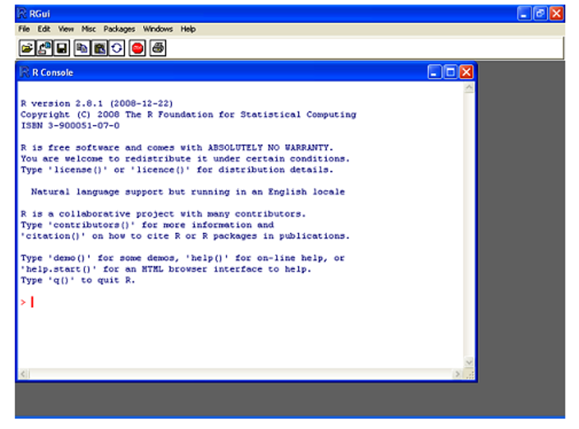
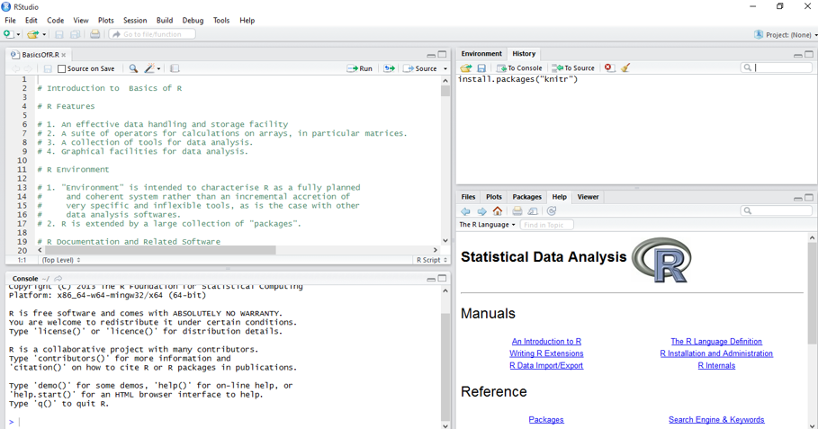

```{css, echo=FALSE}
pre {
  max-height: 300px;
  overflow-y: auto;
}

pre[class] {
  max-height: 150px;
}
```

```{r, echo=FALSE}
options(scipen = 999, digits = 4)
knitr::opts_chunk$set(message = FALSE, warning = FALSE)

```


```{r, echo=FALSE}
library(tidyverse)
library(ggplot2)
library(gapminder)
```


# Introduction | R and RStudio
- https://github.com/uo-ec607/lectures

## Design of the R system
- R system is divided into 2 conceptual parts – 
    + The “base” R system that you download from CRAN https://cran.r-project.org/
    + Everything else.
- The “base” package contains the most fundamental functions used to run R.
- The other packages can be downloaded and installed as per user requirements; for eg.`AER` package is required for econometrics.

## R-console


## RStudio



## RStudio

- R Studio Integrated Development Environment (IDE) is a powerful and productive user interface for R.
- Like R, it is free and multi-platform. It can be downloaded from https://www.rstudio.com/
- RStudio is a separate open-source project that brings many powerful coding tools together into an intuitive, easy-to-learn interface.
- The RStudio program can be run on the desktop or through a web browser. 
- The desktop version is available for Windows, Mac OS X, and Linux platforms 


## Packages in R
- A package is a related set of functions, help files, and data files that have been bundled together. 
- For example, the `stats` package contains functions for doing statistical analysis. Some packages are included in R, other packages are available from public package repositories. You can also make your own packages!
- Visit the [CRAN webpage](https://cran.r-project.org/) for details on contributed packages.


## R Commands and Case Sensitivity
- Technically R is an 'expression language' and is case sensitive, so `A` and `a` are different symbols and would refer to different variables.
- Commands are separated either by a new-line or a semi colon (`;`). 
- Comments can be put almost anywhere starting with a `#`.
- If a command is not complete at the end of a line, R will give a different prompt, by default `+` on second and subsequent lines and continue to read input until the command is syntactically complete.


# The R-language | Basic Concepts


## The assignment operator 
- `<-` is called the assignment operator, read as 'gets'.
```{r}
# assign the value 1 to a.
# a gets the value 1
a <- 1
a
a <- 1 + 2
a
```


## Objects

- The entries that R creates and manipulates are known as 'objects' (more on this later).
- During an R session objects are created and stored by name.
- The R command `objects()` can be used to display the names of the objects that are currently stored within R.
- The collection of objects currently stored is called the 'workspace'.
- To remove objects the function `rm()` is available
```{r, eval=FALSE}
objects(); a <- 1+2; x
objects()
rm(x); objects()
```

## R has 5 basic/atomic classes of objects

- character: `"Hello"`
- numeric(real numbers/decimal numbers): `c(1,2.36)`.
- integer: `10L`
- complex :`2+4i`
- logical: `TRUE/FALSE`.

>- There are other *higher* classes of objects like the `vector`, `matrix`, `dataframe`, `list`, `tibble`, `lm` etc (we shall discuss them later). 


---

- `Inf` is a special number.
```{r}
1/Inf
Inf/Inf
```

- `NaN` (Not A Number) is a value that represents an undefined value `NaN` may represent missing values as well.


---

Objects in R have attributes like `names()`, `length()`, and `class()`, `dimnames()` (for a matrix, array or data frame).
```{r}
a1 <- 12; class(a1); length(a1)
names(a1) <- 'Number'; names(a1)

```

---


You can name an object in R almost anything you want, but there are a few rules.

- First, a name cannot start with a number. 
- Second, a name cannot use some special symbols,like `^`, `!`, `$`, `@`, `+`, `-`, `/`, or `*`.


## Working directory/ Projects
- To check the location of your working directory, use `getwd()`and to set a specific folder as your working directory use `setwd("file path")`. [Demo]
- Projects [Demo]


## The *pass-by-value* and *pass-by-reference* in R
By default, R uses "pass-by-value" paradigm. Consider the following example;
```{r, eval = FALSE}
x <- 1:10
x*2
x
# or consider
y <- x
x*3
y
```


## Coercion {.smaller}
1. Implicit Coercion
1. Explicit Coercion

Implicit Coercion occurs when we try to combine objects of two or more different classes. The ordering is roughly **LINCL** i.e `logical < integer < numeric < complex < character<list`.
```{r}
x <- c(1.7, "a"); class(x)
y <- c(TRUE, 2);class(y)
z <- c("a", TRUE);class(z)

```


## {.smaller}

We can explicitly coerce objects by using `as.*()` functions.
```{r}
x <- c(0,1,2,3,4,5,6)
class(x)
as.character(x)
as.complex(x)
as.logical(x)
```


---

Nonsensical coercion result in `NA`s. `NA` stands for Not Available.
```{r}
x <- c("my", "name ", "is", "khan!")
as.numeric(x)
as.complex(x)
as.logical(x)

```


## Your turn

- Create an integer vector that contains numbers 1 to 5 and assign it to `n`.
- Check the class of `n` and convert it to a character vector. Call it `n_c`.


## Operations on Matrices
Matrices are vectors with `dimension()` attribute.
```{r}
m <- matrix(1:10, nrow = 2, ncol = 5)
m
dim(m)
length(m)
class(m)
```


## Subsetting a matrix
Subsetting a matrix with `[` will subset objects of the same class
```{r, eval=FALSE}
x <- matrix(1:10, 2, 5); x
x[1,2]
x[2,5]
x[,2]
x[2,]
x[,1:3] # subset the first 3 columns of the matrix
x[,c(2,4)] # subset the second and fourth columns
x[1,c(2,4)] # subset the 1st row and second + fourth columns
diag(x) # this works only for a square matrix
t(x) # matrix transpose
```


## Your turn
- Create a 10X6 matrix with numbers between -30 and 30 (excluding 0). (Hint: Use vector subsetting.)
  - Extract the first and second elements from the fourth row. 
  - Extract the second and fifth elements from the second row

```{r, echo=FALSE, eval=FALSE}
matrix(c(-30:30)[-31], nrow = 10)
matrix(c(-30:30)[-31], nrow = 10)[4, 1:2]
matrix(c(-30:30)[-31], nrow = 10)[2, c(2,5)]
```


## Factors {.smaller}
- Factors represent categorical data.
- Factors can be ordered or unordered.
- Factors can be thought as integer vector with labels, like 1 means 'low', 2 means 'high', 3 means 'very high'.
- Example data set
```{r, echo=FALSE, warning=FALSE, message=FALSE}
library(tidyverse); library(kableExtra)
Names <- c("Kunal", "Ben", "Kritika", "Reena", "Narendra", "Smriti")
Gender <- factor(c("Male", "Male", "Female", "Female", "Male", "Female"))
Month.Birth <- factor(c("January", "March", "March", "December", "October", "October"))
kable(data.frame(Names, Gender, Month.Birth)) %>% kable_styling(bootstrap_options = c("striped", "hover"), full_width = FALSE, position = "center")
```


---

We can create factors using the information in the previous table:
```{r, eval=FALSE}
(Names <- c("Kunal", "Ben", "Kritika", "Reena", "Narendra", "Smriti"))
(Gender <- factor(c("Male", "Male", "Female", "Female", "Male", "Female")))
(Month.Birth <- factor(c("January", "March", "March", "December", "October", "October")))
(Month.Birth <- factor(c("January", "March", "March", "December", "October", "October"), levels = c("January", "March", "October", "December")))
```


## Extraction and subsetting {.smaller}

```{r, echo=FALSE, warning=FALSE, message=FALSE}
library(tidyverse); library(kableExtra)
Names <- c("Kunal", "Ben", "Kritika", "Reena", "Narendra", "Smriti")
Gender <- factor(c("Male", "Male", "Female", "Female", "Male", "Female"))
Month.Birth <- factor(c("January", "March", "March", "December", "October", "October"))
kable(data.frame(Names, Gender, Month.Birth)) %>% kable_styling(bootstrap_options = c("striped", "hover"), full_width = FALSE, position = "center")
```

- Which month was Smriti born in?
```{r}
Month.Birth[Names == "Smriti"]
```

## Extraction and subsetting {.smaller}

```{r, echo=FALSE, warning=FALSE, message=FALSE}
library(tidyverse); library(kableExtra)
Names <- c("Kunal", "Ben", "Kritika", "Reena", "Narendra", "Smriti")
Gender <- factor(c("Male", "Male", "Female", "Female", "Male", "Female"))
Month.Birth <- factor(c("January", "March", "March", "December", "October", "October"))
kable(data.frame(Names, Gender, Month.Birth)) %>% kable_styling(bootstrap_options = c("striped", "hover"), full_width = FALSE, position = "center")
```


- Which boy was born in March?
```{r}
Names[Gender == "Male" & Month.Birth == "March"]
```


## Releveling a factor
```{r}
(levels(Month.Birth) <- c(1, 3, 10, 12))
(levels(Gender) <- c(0, 1)) # 0 indicates female
```


## Defining and Ordering levels
- Performance ratings example

```{r}
m <- c("Poor", "Good", "Better")
rate <- factor(m)

(rate <- factor(m, ordered = TRUE,
                levels = m))

```

## Defining and Ordering levels
- LIKERT scale example

```{r}
s <- 1:5
rating <- factor(s)

(rating <- factor(s, ordered = TRUE,
                levels = s))

```


## Your turn {.smaller}

<style>
.divScroll {
overflow:scroll;
height:500px;
width:900px;
}
</style>

<div class="divScroll">
The Indian government consists of the political parties **BJP**, **INC**, **CPI**, **TMC** and other parties grouped under **Others** category. Suppose you asked 20 Indians which of these they identified most with and obtained the following data:

- There were 12 males and 8 females; the individuals numbered 1, 5-7, 12, and 14-16 were females.
- The individuals numbered 1,4,12,15,16 and 19 identified with *BJP*; no one identified with *CPI*, the individuals numbered 6,9 and 11 identified with *INC*, 10 and 20 identified with *Others*, and the rest with *TMC*.

a.Use your knowledge of vectors (for example, subsetting and overwriting) to create two character vectors: **sex** with entries "M" (male) and "F" (female) and **party** with entries "BJP", "INC", "CPI", "TMC", and "Others". Make sure the entries are placed in the correct positions as outlined earlier.
    
```{r, include=FALSE}
sex <- c(rep("M", times = 20))
sex[c(1, 5:7, 12, 14:16)] <- "F"
sex_fac <- as.factor(sex)

party <- c(rep("TMC", times = 20))
party[c(6,9, 11)] <- "INC"
party[c(10, 20)] <- "Others"
party[c(1,4,12,15,16, 19)] <- "BJP"
party_fac <- as.factor(party)
```

b.Create two different factor vectors based on **sex** and **party**. Does it make any sense to use `ordered=TRUE` in either case? How has R appeared to arrange the levels?
    
```{r, include=FALSE}
party1 <- factor(party, ordered = TRUE)
```
    
c.Use factor subsetting to do the following:
    i. Return the factor vector of chosen parties for only the male participants.
    ii. Return the factor vector of genders for those who chose BJP.
        
```{r, include=FALSE}
party_fac[sex_fac == "M"]
sex_fac[party_fac == "BJP"]
```
        
d.Another six people joined the survey, with the results **c("BJP","INC","INC","CPM","TMC","BJP")** for the preferred party and **c("M","M","F","F","F","M")** as their gender. Combine these results with the original factors from (b).
  
```{r, include=FALSE}
party0 <-  c("BJP","INC","INC","CPM","TMC","BJP")
sex0 <- c("M","M","F","F","F","M")

sex_fac_comb <- factor(c(sex, sex0))
party_fac_comb <- factor(c(party, party0))
```

</div>


## Data frames 

- Data frames are used to store tabular data.
- Data frames have an advantage over matrices in that they can store objects of different classes.

```{r}

mydata <- data.frame(Name =   c("Kunal", "Ben", "Kritika", "Reena", "Narendra", "Smriti"),
Gender = factor(c("M", "M", "F", "F", "M", "F"), levels = c("M", "F")),
Age = c(20, 18, 30, 24, 24, 27))
mydata
```

## {.smaller}

- Subsetting
```{r}
mydata$Name
mydata[,c("Name", "Age")]
mydata[,c(1,3)]
```


## Tibble
- Tibbles are data frames tweaked to work better in the `tidyverse`.
- It’s possible for a tibble to have column names that are not valid R variable names, aka non-syntactic names.
```{r}
tibble(
  `:)` = "smile", 
  ` ` = "space",
  `2000` = "number"
)
```


---

- Another way to create a tibble is with `tribble()`, short for t**r**ansposed tibble. 

```{r}
tribble(
  ~x, ~y, ~z,
  "a", 2, 3.6,
  "b", 1, 8.5
)
```

## Printing large datasets

<div style="float: left; width: 45%;">
```{r, message=FALSE, warning=FALSE}
library(AER); data("Journals")
Journals
```
</div>

<div style="float: right; width: 45%;">
```{r, message=FALSE, warning=FALSE}
as_tibble(Journals)
```
</div>


## Logical Operators

```{r, echo=FALSE, warning=FALSE, message=FALSE}
library(tidyverse); library(kableExtra)
c1 <- c("TRUE & TRUE = TRUE", "TRUE & FALSE = FALSE", "FALSE & TRUE = FALSE", "FALSE & FALSE = FALSE")
c2 <- c("TRUE | TRUE = TRUE", "TRUE | FALSE is TRUE", "FALSE | TRUE is TRUE", "FALSE | FALSE is FALSE")
c3 <- c("!TRUE = FALSE", "!FALSE = TRUE")

dt <- data.frame(Operator = c(rep("&",times = 4), "&&", rep("|",times = 4), "||", rep("!",times = 2)),
                 Interpretation = c(rep("AND (element-wise)",4), "AND (single comparison)", 
                                    rep("OR (element-wise)", 4), "OR (single comparison)", rep("NOT", 2)),
                 Results = c(c1, "same as above", c2, "same as above", c3))
knitr::kable(dt) %>%
    kable_styling(bootstrap_options = c("bordered"), position = "center", full_width = FALSE) %>%
    collapse_rows(columns = 1:2, valign = "middle")
```


---

Some examples
```{r}
a <- c(T,F,T,F); a
b <- c(F,T,T,T); b
a&b; a&&b
a|b; a||b
```
