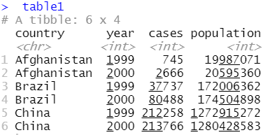
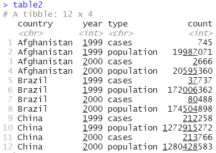
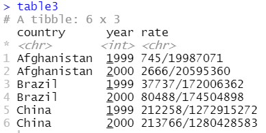
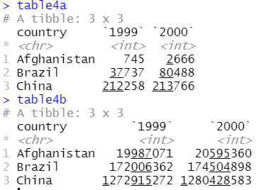

```{css, echo=FALSE}
pre {
  max-height: 300px;
  overflow-y: auto;
}

pre[class] {
  max-height: 150px;
}
```

```{r, echo=FALSE}
options(scipen = 999, digits = 4)
knitr::opts_chunk$set(message = FALSE, warning = FALSE)
library(tidyverse)
library(ggplot2)
library(gapminder)
```


# <font color="black">Tidyverse | `ggolot2` </font> {data-background=workshop/tidyverse.PNG data-background-size=auto data-background-position=right}


## {.smaller}
- Install the packages `install.packages(c("ggplot2", "gapminder"), dependencies = TRUE)` 
- Load the packages: 
```{r, warning=FALSE, message=FALSE}
library(gapminder); library(ggplot2)
data(package = 'gapminder')
data("gapminder")
gapminder #panel data on life expectancy, population size, and GDP per capita for 142 countries since the 1950s.
```


---

- Creating a ggplot
```{r}
ggplot(data = gapminder)+ 
  geom_point(mapping =  aes(x = gdpPercap, y = lifeExp))
```

---

```{r}
ggplot(data = gapminder, aes(log(gdpPercap), log(lifeExp)))+ # Global aesthetic mapping
  geom_point(mapping =  aes(col = continent, size = pop),
             alpha = 0.2)
```


---


```{r}
ggplot(data = filter(gapminder, year == 2002), aes((gdpPercap), (lifeExp)))+ # Global aesthetic mapping
  geom_point(aes(shape = continent),  alpha = 0.3)
```


## {.build}

```{r}
ggplot(data = filter(gapminder, year == 2002), aes((gdpPercap), (lifeExp)))+ # Global aesthetic mapping
  geom_point(aes(shape = continent),  alpha = 0.3)+
  geom_text(aes(label =if_else(gdpPercap > 30000 & lifeExp > 75, as.character(country), "")))
```


## {.build}

```{r}
library(ggrepel) # text labels repels away from each other
ggplot(data = filter(gapminder, year == 2002), aes((gdpPercap), (lifeExp)))+ # Global aesthetic mapping
  geom_point(aes(shape = continent),  alpha = 0.3)+
  geom_text_repel(aes(label =if_else(gdpPercap > 30000 & lifeExp > 75, as.character(country), "")), max.overlaps = 35)
```


---


```{r}
library(ggrepel) # text labels repels away from each other
ggplot(data = filter(gapminder, year == 2002), aes((gdpPercap), (lifeExp)))+ # Global aesthetic mapping
  geom_point(aes(shape = continent),  alpha = 0.3)+
  geom_label_repel(aes(label =if_else(gdpPercap > 30000 & lifeExp > 75, as.character(country), "")), max.overlaps = 35)
```


---

`nudge_x` and `nudge_y`

- Use the `nudge_x` and the `nudge_y` arguments to repel better.
- Both the arguments use their respective units on the x-axis and the y-axis.
- Try the previous example with the values of 
  - `nudge_x = ` -3000
  - `nudge_y = ` -15


---


```{r}
library(ggrepel) # text labels repels away from each other
ggplot(data = filter(gapminder, year == 2002), aes((gdpPercap), (lifeExp)))+ # Global aesthetic mapping
  geom_point(aes(shape = continent),  alpha = 0.3)+
  geom_text_repel(aes(label =if_else(gdpPercap > 40000 & lifeExp > 75, as.character(country), "")), max.overlaps = 35, nudge_x = 0.1, nudge_y = 0.1)+
  geom_point(aes(x = filter(gapminder, year == 2002, gdpPercap > 40000 & lifeExp > 75)$gdpPercap,y = filter(gapminder, year == 2002, gdpPercap > 40000 &lifeExp > 75)$lifeExp), col = "red")+
  geom_label_repel(aes(label =if_else(country == "India", as.character(country), "")), max.overlaps = 35, nudge_x = 0.1, nudge_y = 0.1)+
  geom_point(aes(x = filter(gapminder, year == 2002, country == "India")$gdpPercap,y = filter(gapminder, year == 2002, country == "India")$lifeExp), col = "red")
```


---


Facets (wrap)

```{r}
ggplot(gapminder) +
  geom_point(aes(log(gdpPercap), log(lifeExp)), alpha = 0.3)+
  facet_wrap(~ continent)
```


---


Facets (grid)

```{r}
ggplot(gapminder) +
  geom_point(aes(log(gdpPercap), log(lifeExp)), alpha = 0.3)+
  facet_grid(. ~ continent)
```


---


```{r}
ggplot(gapminder) +
  geom_point(aes(log(gdpPercap), log(lifeExp)), alpha = 0.3)+
  facet_grid(year ~ continent)
```


---


```{r}
ggplot(gapminder) +
  geom_point(aes(log(gdpPercap), log(lifeExp)), alpha = 0.3)+
  facet_grid(. ~ year)
```


## {.smaller}


```{r}
ggplot(filter(gapminder))+
  geom_bar(aes(continent), stat = "count") # the bars

```


---


```{r}
(Population <- filter(gapminder, year == 2007) %>% 
  group_by(continent) %>% 
  summarise(popu = round(sum(pop/1000000000),2)))
```


---


```{r}
Population %>% 
ggplot(aes(continent, popu))+
  geom_bar( stat = "identity") # the bars are the population figures w.r.t the continents
```


---


```{r}
# reorder() from base package
Population %>% 
ggplot(aes(reorder(continent, popu), popu))+
  geom_bar(stat = "identity") +
  labs(x = "Continent",
       y = "Population (in billions)")

```


---


```{r}
# reorder() from base package
Population %>% 
ggplot(aes(reorder(continent, -popu), popu))+
  geom_bar(stat = "identity") +
  labs(x = "Continent",
       y = "Population (in billions)")
```


---

```{r}
 Population %>% 
   ggplot(aes(reorder(continent, popu), popu))+
   geom_bar(stat = "identity")+
   geom_text(aes(label = popu))+
   expand_limits(y = c(0, 4.5)) +
   labs(x = "Continent", y = "Population (in billions)",
        title = "Population for 2007")
```


---

```{r}
 Population %>% 
   ggplot(aes(reorder(continent, popu), popu))+
   geom_bar(stat = "identity")+
   geom_text(aes(label = popu),
                   vjust = - 0.5)+
   expand_limits(y = c(0, 4.5)) +
   labs(x = "Continent", y = "Population (in billions)",
        title = "Population for 2007")
```


---

```{r}
(Population_prop <- Population %>% 
   mutate(propo = round(popu/sum(popu),3)))
```

---

```{r}
 Population_prop %>% 
   ggplot(aes(reorder(continent, propo),propo))+
  geom_bar(stat = "identity")+
  expand_limits(y = c(0,0.75))+
  geom_text(aes(label = propo), vjust = -0.5)+
   labs(x = "Continent", y = "Population (in %)",
        title = "Population for 2007")
```


---

We will do more plots later!


# <font color="black">Tidyverse | Data transformation </font> {data-background=workshop/tidyverse.PNG data-background-size=auto data-background-position=right}


---

**Packages and Data**

- `dplyr` package
  - `filter()`, `arrange()`, `select()`, `mutate()`, `summarise()` functions/verbs.
- `library(tidyverse)`
- `gapminder` data set


---


```{r, message=FALSE, warning=FALSE}
library(gapminder)
data(gapminder)
gapminder
```

---


**Filter rows with `filter()`**

- Filter all the countries in Asia for 1952.

*Note that `==` is used for comparison and `=` for assignment.* 
```{r}
filter(gapminder, continent == "Asia", year == 1952)
```

---

- Find all the countries in Asia or Africa.
```{r, eval=-1}
filter(gapminder, continent == "Asia" | continent == "Africa") 
# or
filter(gapminder, continent %in% c("Asia", "Africa"))
```
- `%in%` is used to see whether an object is contained within (i.e. matches one of) a list of items.

---

Find all the countries with per capita GDP between $\$500$ and $\$1000$.
```{r}
filter(gapminder, gdpPercap >= 500 & gdpPercap <= 1000 )
```


---

**Arrange rows with `arrange()`**

- Sorts a variable in ascending or descending order.
```{r}
arrange(gapminder, lifeExp)
```

---

```{r}
arrange(gapminder, desc(lifeExp))
```


---

**Select columns with `select()`**

- Select columns by name
```{r}
select(gapminder, year, pop, gdpPercap)
```


---


- `select(gapminder, year:gdpPercap)`
- `select(gapminder, -(year:gdpPercap))`
- `select(gapminder, starts_with("c"))`
- `select(gapminder, ends_with("p"))`
- `select(gapminder, contains("life"))`


 
---

`rename()` is a variant of `select()` that keeps all the variables that aren’t explicitly mentioned.
```{r}
rename(gapminder, perCapInc = gdpPercap)
```


---

**Add new variables with `mutate()`**

```{r}
mutate(gapminder, gdp = gdpPercap*pop)
```


---

Keep only required columns/variables with `transmute()`.
```{r}
transmute(gapminder, gdp = gdpPercap*pop)

```


## {.smaller}

**Combining multiple operations with the `%>%`**

```{r}
gapminder %>% 
  filter(country == "India")
```

Behind the scenes, `x %>% f(y)` turns into `f(x, y)`, and `x %>% f(y) %>% g(z)` turns into `g(f(x, y), z)` and so on. 

---

**Grouped summaries with `summarise()`**

- Find the mean life expectancy for India during 1952-2007.
```{r}
gapminder %>% 
  filter(country == "India") %>% 
  summarise(mean_lifeExp = mean(lifeExp))
```


---


- Compare the mean life expectancy of India and China during 1952-2007.
```{r}
gapminder %>% 
  filter(country %in% c("India", "China")) %>% 
  group_by(country) %>% 
  summarise(mean_lifeExp = mean(lifeExp))
```


---

**Some useful summary functions**

- Measures of location: `mean(x)`, `median(x)`
- Measures of spread: `sd(x)`, `IQR(x)`, `mad(x)`
- Measures of rank: `min(x)`, `quantile(x, 0.25)`, `max(x)`
- Measures of position: `first(x)`, `nth(x)`, `last(x)`
- Count: `n(x)`


# <font color="black">Tidyverse | Tidy data </font> {data-background=workshop/tidyverse.PNG data-background-size=auto data-background-position=right}

## {.smaller}

- Compute $rate = (cases / population)*100$ separately for `table1`, `table2`, `table3`, `table4a` and `table4b`


<div style="float: left; width: 45%;">


</div>

<div style="float: right; width: 45%;">


</div>


---

**Pivot Longer**


```{r, echo=FALSE, out.width= "100%" }
knitr::include_graphics("https://d33wubrfki0l68.cloudfront.net/3aea19108d39606bbe49981acda07696c0c7fcd8/2de65/images/tidy-9.png")
```


```{r, eval=FALSE}
table4a %>% 
  pivot_longer(c(`1999`, `2000`), names_to = "year", values_to = "cases")
```


---

**Pivot wider**


```{r, echo=FALSE, out.width= "80%" }
knitr::include_graphics("https://d33wubrfki0l68.cloudfront.net/8350f0dda414629b9d6c354f87acf5c5f722be43/bcb84/images/tidy-8.png")
```


```{r, eval=FALSE}
table2 %>% 
  pivot_wider(names_from = type, values_from = count)
```


## {.smaller}

**Separating**

```{r, echo=FALSE, out.width= "80%" }
knitr::include_graphics("https://d33wubrfki0l68.cloudfront.net/f6fca537e77896868fedcd85d9d01031930d76c9/637d9/images/tidy-17.png")
```

```{r, eval=FALSE, warning=FALSE}
table3 %>% 
  separate(col = rate, into = c("cases", "population"), sep = "/")
```


## {.smaller}


```{r, message=FALSE, warning=FALSE}
table3 %>% 
  separate(col = rate, into = c("cases", "population"), sep = "/")
```


```{r, message=FALSE, warning=FALSE}
table3 %>% 
  separate(col = rate, into = c("cases", "population"), sep = "/", convert = TRUE)
```

